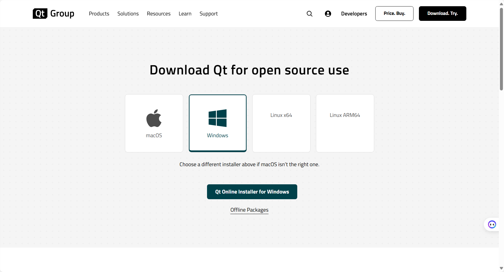
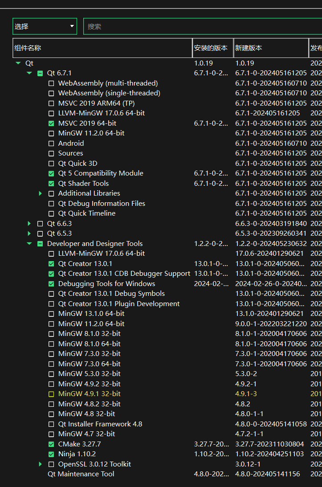

# 安装Qt
从这里获取
[Qt Online Installer](https://www.qt.io/download-qt-installer-oss?hsCtaTracking=99d9dd4f-5681-48d2-b096-470725510d34%7C074ddad0-fdef-4e53-8aa8-5e8a876d6ab4)

你会看到如下页面，点击下载Qt在线安装程序

## 安装向导
### STEP1 
输入你的账户，如果没有请注册之后输入，然后点下一步

### STEP2

+ MSVC-2019-64bit (**Essential**)
+ Qt Shader Tools (**Essential**)
+ Qt 5 Compatibility Module (**Essential**)

### STEP3
为了正常使用MSVC编译器，还需要安装Visual Studio Build Tools.

这里是下载链接 
[Visual Studio 2019 Build Tools 直链](https://aka.ms/vs/16/release/vs_buildtools.exe)

## 下载项目并构建

### STEP1
访问 [项目地址](https://github.com/zhuzichu520/FluentUI)

下载项目到本地，并解压

